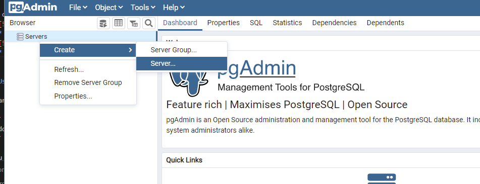
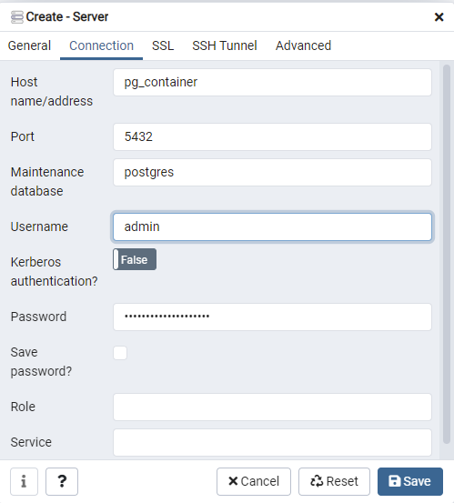
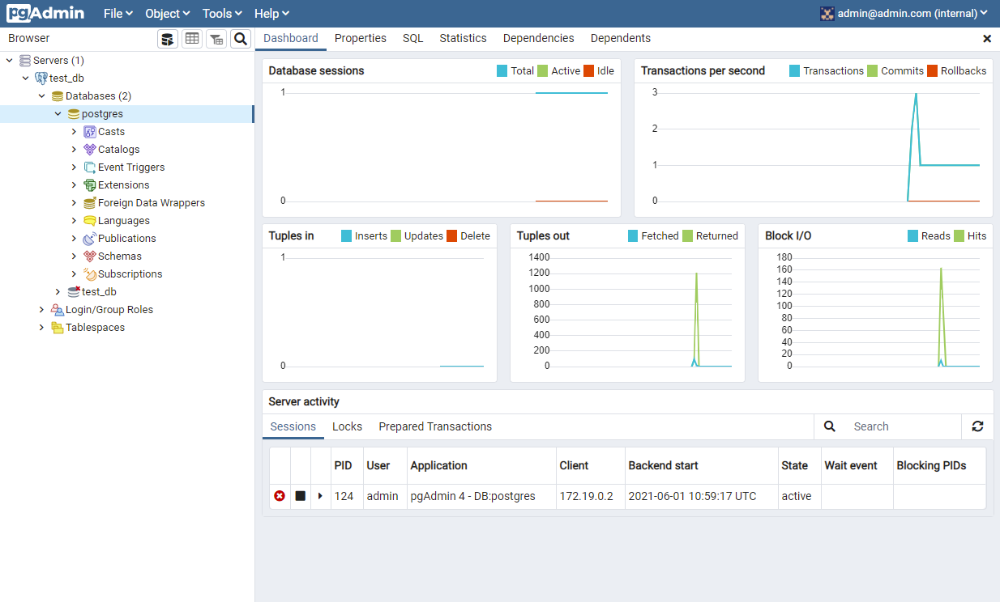

# PostgreSQL 

PostgreSQL is a powerful, open source object-relational database system with over 30 years of active development that has earned it a strong reputation for reliability, feature robustness, and performance.

For more info please visit PostgreSQL [official page](https://www.postgresql.org/)

# Requirements

By default, the stack exposes the following ports:
* [5432](5432): default port for PostgreSQL
  * Default credentials: `admin` / `<YourStrongPassw0rd>`
* [5050](http://localhost:5050): default port for PgAdmin
  * Default credentials: `admin@admin.com` / `<YourStrongPassw0rd>`


# Usage

Start services locally using Docker Compose:

```
$ docker-compose up
```

You can also run all services in the background (detached mode) by adding the `-d` flag to the above command.

* Default DB Connection available at [5432](5432)
* Default PgAdmin available at [http://localhost:5050](http://localhost:5050)
* Default credentials: `admin` / `<YourStrongPassw0rd>`

## Connect to PostgreSQL DB

### Via Shell:
```
# connect to docker container
$ docker exec -it pg_container bash

# connect to postgres
$ psql -d test_db -U root -p 5432
```

## Connect to pgAdmin

### Step 01 - Create new server


### Step 02 - Set connection details


### Step 03 - View Dashboard



# Cleanup 

Data is peristed inside a volume by default.

To shutdown the stack **without** removing all persisted data, use the following Docker Compose command:
```
$ docker-compose down
```

In order to entirely shutdown the stack and remove all persisted data, you can add the `-v` flag to the above command:

```
$ docker-compose down -v
```
